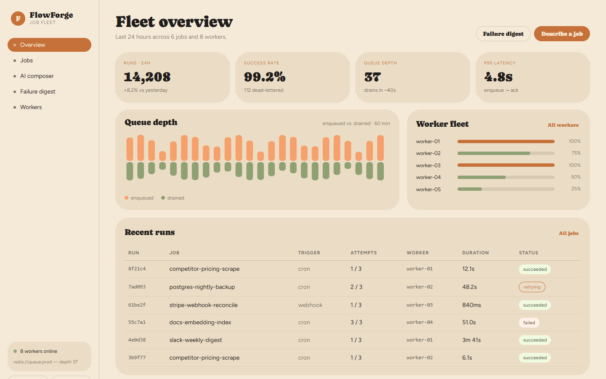
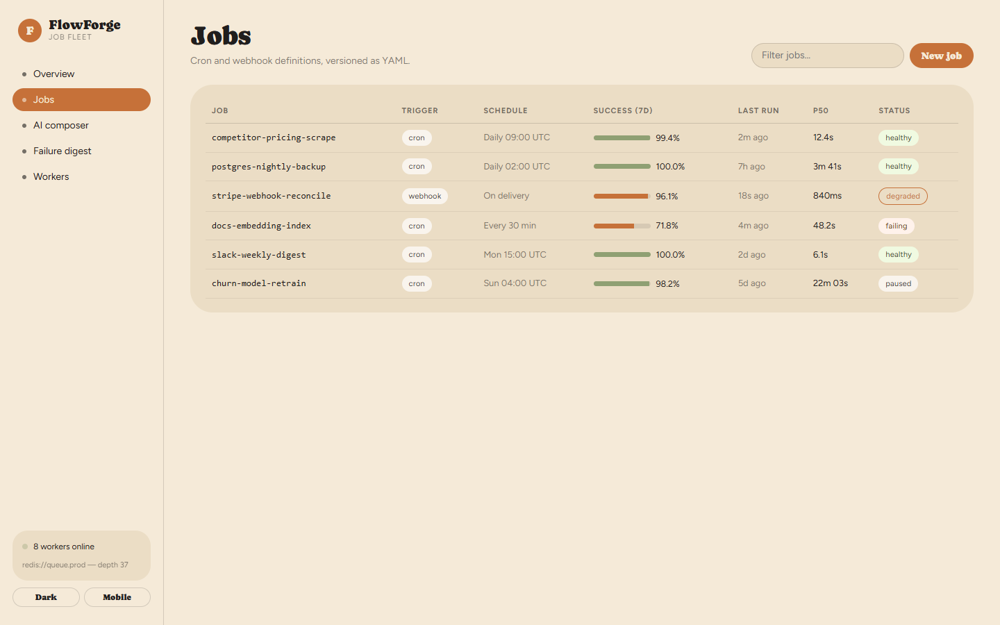
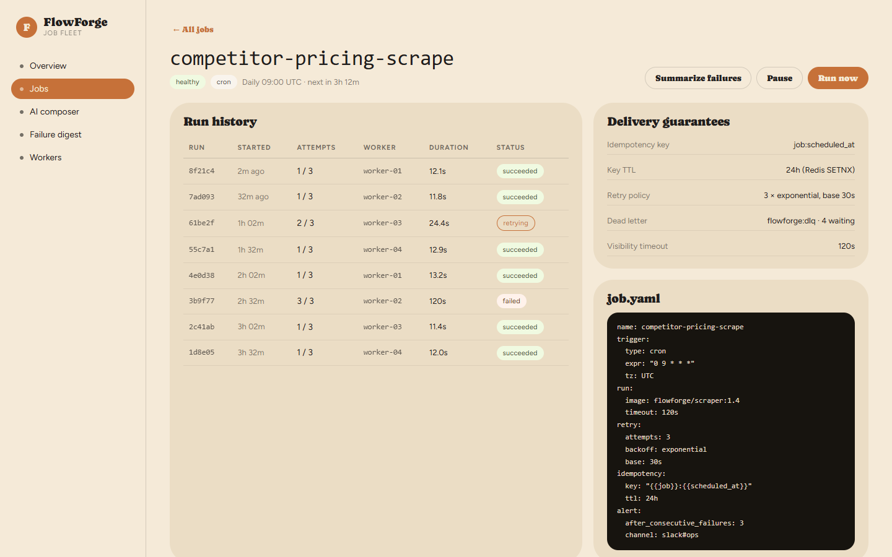
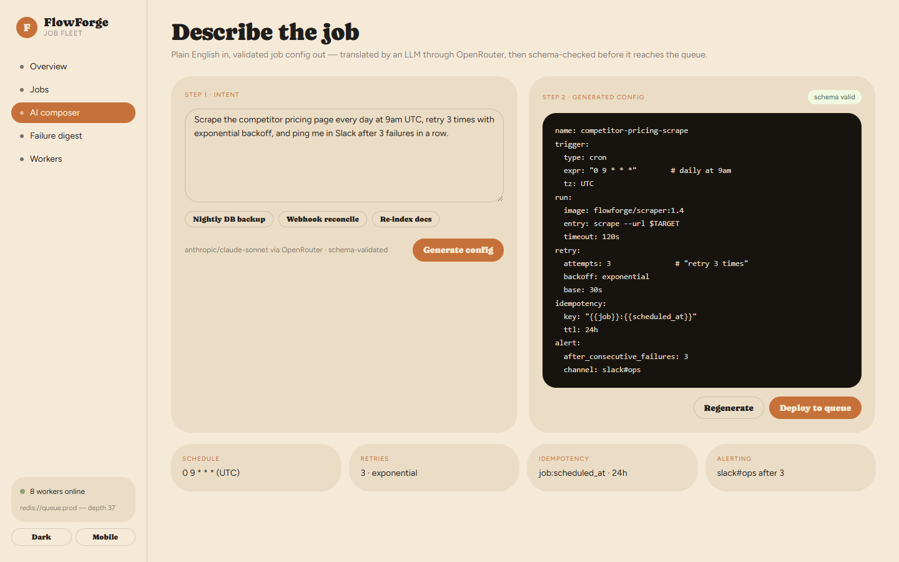
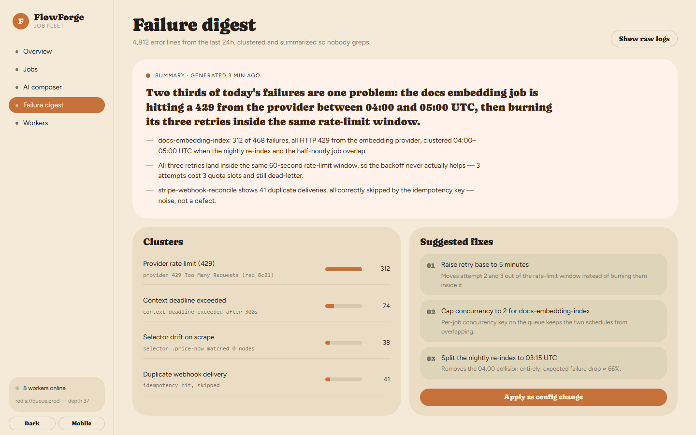
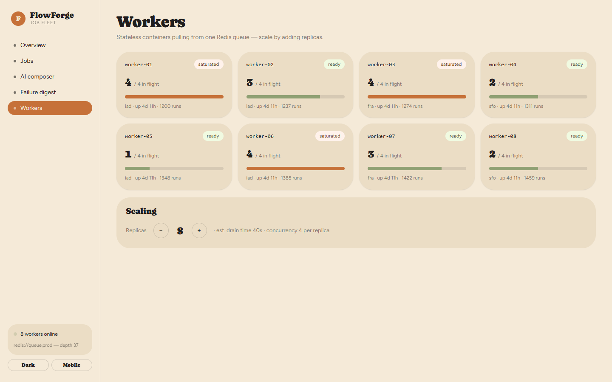
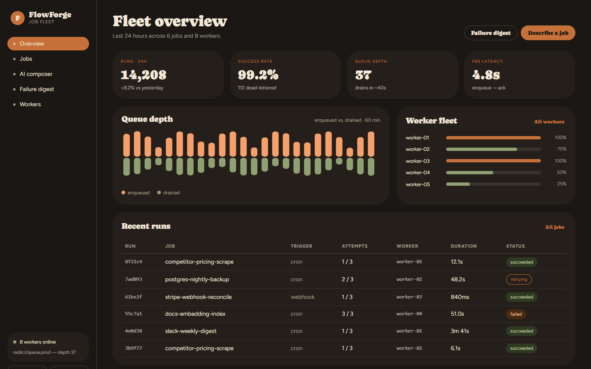

# FlowForge

**Distributed Job Scheduler with AI-Assisted Config**

A lightweight Zapier / GitHub-Actions-style platform: users define scheduled or
webhook-triggered jobs, a fleet of worker processes executes them, and a live
dashboard streams status and logs. An AI assistant turns a plain-English job
description into a structured, schema-validated config, and another
summarizes failure patterns from raw logs instead of making anyone grep
through them.

This project exists to make "system design" more than a resume buzzword — it
forces building the actual patterns interviewers probe (queues, retries,
idempotency, worker scaling), not just describing them.

## Status

The dashboard UI is built and running against mock data — no backend yet.
See [Roadmap](#roadmap) for what's next.

**Live:** [flowforge-zeta-ten.vercel.app](https://flowforge-zeta-ten.vercel.app)

## Screenshots

**Fleet overview** — runs, success rate, queue depth, and worker load at a glance.


**Jobs** — cron and webhook definitions, versioned as YAML.


**Job detail** — run history, delivery guarantees, and a live log stream.


**AI composer** — plain English in, a validated job config out.


**Failure digest** — an LLM-written summary of clustered failures, plus suggested fixes.


**Workers** — the fleet, with horizontal scaling.


**Dark mode**


## Stack

- **Backend (planned):** Node.js + TypeScript, Redis-backed queue (BullMQ) driving a worker fleet.
- **Execution (planned):** workers run scheduled/webhook-triggered jobs with retries and idempotency; live status/log dashboard.
- **AI (planned):** plain-English job definitions translated into structured configs via OpenRouter; LLM-generated summaries of failure patterns from raw logs.
- **Frontend (built):** React + TypeScript + Vite, in [`web/`](web).
- **Containerization (planned):** Docker; workers horizontally scalable behind the queue.

## Repo layout

```
FlowForge/
├── desc.txt          # project pitch, stack, and resume goals
├── docs/screenshots/  # README screenshots
└── web/               # React/TypeScript dashboard (Vite)
    └── src/
        ├── App.tsx        # state, effects, page routing
        ├── components/    # Sidebar, MobileView
        ├── pages/          # Overview, Jobs, JobDetail, Composer, Failures, Workers
        ├── data/mockData.ts  # placeholder jobs/logs/YAML until wired to a real API
        └── styles/tokens.css # design-system tokens
```

## Running the dashboard

```bash
cd web
npm install
npm run dev      # http://localhost:5173
```

```bash
npm run build     # production build
```

## Roadmap

1. Redis-backed queue (BullMQ) + worker process with retries and idempotency.
2. API layer: job CRUD, webhook ingress, live status/log stream (WebSocket/SSE).
3. Wire the dashboard to the real API in place of `mockData.ts`.
4. Horizontal worker scaling via Docker Compose.
5. AI composer: plain-English → structured config via OpenRouter, schema-validated.
6. AI failure digest: summarize clustered log failures via an LLM.
7. Dockerize everything; deploy the dashboard (Vercel) with the queue/workers on an AWS EC2 instance (free tier credit), Redis running on the same instance.
