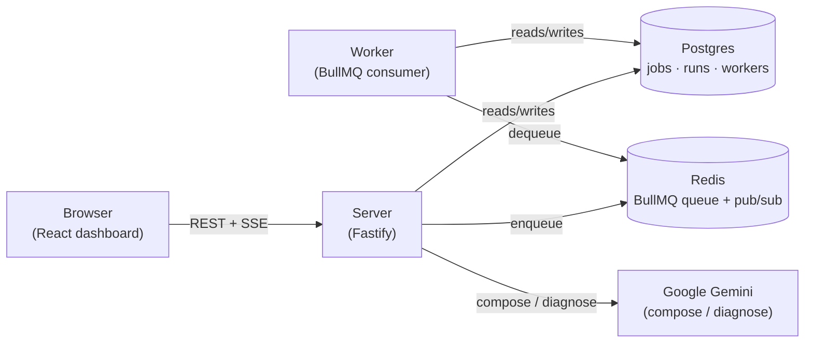
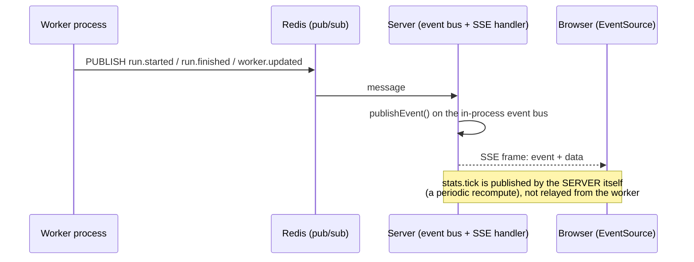

# FlowForge

**A job-scheduler dashboard with an AI composer and AI failure digest**

A lightweight Zapier / GitHub-Actions-style platform: users define scheduled
or webhook-triggered jobs, a fleet of worker processes executes them with
retries and idempotency, and a live dashboard streams status and logs in
real time. An AI assistant turns a plain-English job description into a
structured, schema-validated config, and another summarizes failure
patterns from raw logs instead of making anyone grep through them.

This project exists to make "system design" more than a resume buzzword —
it forces building the actual patterns interviewers probe (queues, retries,
idempotency, worker scaling, realtime delivery), not just describing them.

**Live:** [flowforge-zeta-ten.vercel.app](https://flowforge-zeta-ten.vercel.app)

## Status

The full stack is built: server, worker, Postgres/Redis-backed queue, AI
composer and failure digest, and a live dashboard — all wired end to end
and browser-verified. Deployment (Phase 3, AWS) has not started; everything
below runs locally.

## Screenshots

**Fleet overview** — runs, success rate, queue depth, and worker load at a glance.


**Jobs** — cron and webhook definitions, versioned as YAML.


**Job detail** — run history, delivery guarantees, and a live log stream.


**AI composer** — plain English in, a validated job config out.


**Failure digest** — an LLM-written summary of clustered failures, plus suggested fixes.


**Workers** — the fleet, with horizontal scaling.


**Dark mode**


## Stack

- **API server:** Fastify + TypeScript ([`server/`](server)) — job/run/worker/failure/AI routes, Server-Sent Events for live updates.
- **Worker:** BullMQ consumer ([`worker/`](worker)) — executes jobs with retries, exponential backoff, and idempotency, running as a separate process from the server (matches how it would actually be deployed).
- **Queue/pub-sub:** Redis (BullMQ queue + a pub/sub bridge that carries worker-originated events into the server's SSE stream).
- **Database:** Postgres via Drizzle ORM, shared table definitions in [`packages/shared`](packages/shared) so the server and worker never maintain two copies of the schema.
- **Frontend:** React + TypeScript + Vite, in [`web/`](web).
- **AI:** Google Gemini — plain-English job composition and failure-cluster diagnosis, both schema-validated before anything reaches the database (see [Design decisions](#design-decisions-and-trade-offs)).

## Architecture



The server and worker are separate processes, each with its own `.env`,
talking only through Postgres and Redis — never directly to each other.
This is the same shape a real deployment would take (Phase 3: server on one
process, worker fleet horizontally scaled behind the same queue).

## Realtime bridge

The dashboard updates live — a fired job's status, a killed worker's
badge, the Overview's counters — without polling. This path failed
verification three times during development (see
[Design decisions](#design-decisions-and-trade-offs)), so it's documented
here in full rather than summarized.



Two publishers feed the same SSE stream: the **worker**, whose events
(`run.started`, `run.finished`, `worker.updated`) travel over Redis pub/sub
because the worker is a different OS process from the server; and the
**server itself**, which publishes `stats.tick` directly onto its own
in-process event bus every few seconds (the Overview payload is
recomputed server-side, not forwarded from anywhere). Both land on the same
`event-bus.ts` and are pushed to every connected browser by
`sse.handler.ts`.

## Repo layout

```
FlowForge/
├── server/         # Fastify API — routes → services → repositories → db
├── worker/         # BullMQ consumer — task execution, retries, idempotency
├── packages/shared/ # Drizzle schema, zod schemas, enums — shared by server + worker
├── web/            # React/TypeScript dashboard (Vite)
├── qa/             # Playwright browser QA harness (qa_runner.mjs)
├── docs/screenshots/
├── SETUP.md        # every credential the backend needs, in order
├── DECISIONS.md    # spec deviations, bugs found, and why — a running log, not retroactive
└── HANDOFF.md       # current state, for picking work back up cold
```

## Running it locally

Server and worker are two separate processes — see [SETUP.md](SETUP.md)
for the credentials each `.env` needs (Postgres, Redis, Gemini API key).

```bash
pnpm install
pnpm dev      # server + worker + web, from the repo root
```

Or run each independently:

```bash
pnpm --filter=@flowforge/server dev   # http://localhost:3001
pnpm --filter=@flowforge/worker dev   # no port — just processes the queue
pnpm --filter=@flowforge/web dev      # http://localhost:5173
```

Before demoing or running a browser QA pass, re-seed so worker heartbeats
and run history aren't stale — see SETUP.md's "Before demoing" section.

## Tests

```bash
pnpm -r test
```

218 tests across three packages: 33 shared (schemas/rules), 147 server
(route-level tests for every `/api` endpoint, mocked-service unit tests,
failure-clustering logic, and real-database integration tests for the two
repositories with non-trivial SQL — percentile aggregation,
`generate_series` gap-fill, and keyset pagination's tie-break clause), 38
worker (task handlers, retry math, idempotency claim behavior against a
real database).

## Load test

`server/scripts/load-test.ts` pushes 10,000 runs through the real queue —
9,000 with unique idempotency keys and 1,000 duplicate submissions drawn
from 100 distinct keys (10 submissions each, so the expected dedup count —
900 — is computable in advance, not just observed), interleaved through
the run rather than clustered at the end, with a subset of duplicate keys
fired as genuinely concurrent submissions to exercise the idempotency
claim's actual race window.

**What this number measures, and what it doesn't:** queue throughput and
worker concurrency are local (Redis via Memurai, worker concurrency 50 on
this machine). Every run's status write (`queued` → `running` →
`succeeded`) crosses a real network to a hosted Neon Postgres instance
(ap-southeast-1, Singapore) from a machine in Bengaluru — this is **not**
a pure queue benchmark. A sequential round-trip to that database measured
~88ms; at that rate, 10,000 sequential inserts alone would take roughly 15
minutes regardless of queue/worker capacity. The script batches DB inserts
(500 rows per round-trip) specifically to avoid that becoming the
bottleneck being measured — see `DECISIONS.md` for the full finding.

Run it: `pnpm --filter=@flowforge/server exec tsx scripts/load-test.ts`

**Results (measured, hosted Neon + local Memurai, DB batch size 500, worker concurrency 50):**

| Metric | Value |
| --- | --- |
| Total submitted | 10,000 (9,000 unique + 1,000 duplicate submissions) |
| Enqueue time | 122.4s |
| Drain time (after enqueue completes) | 168.6s |
| Total wall time | 291.0s |
| Throughput (submitted / total wall time) | 34.4 jobs/sec |
| Throughput (executed / total wall time) | 31.3 jobs/sec — excludes deduped runs, which never ran the task |
| Executed (succeeded) | 9,100 |
| Deduped — expected vs. actual | 900 expected / 900 actual |
| Worker peak RSS | 51.9 MB |

This run also caught a real defect, not just a number: the worker's Postgres
connection pool defaulted to 10 regardless of `WORKER_CONCURRENCY` (50),
which collapsed throughput under sustained load well before this final
number was reached. Fixed by deriving the pool size from
`WORKER_CONCURRENCY` instead of leaving it at the client library's default
— see DECISIONS.md for the full finding, including why it was invisible
in normal dev use.

## Design decisions and trade-offs

**Why a queue, not direct execution.** A job trigger (manual, webhook, or a
cron tick) never runs a task inline — it writes a `queued` run row and
enqueues a BullMQ job. This decouples "something wants this job to run"
from "a worker happens to be free right now," which is what makes retries,
backoff, and horizontal worker scaling possible without touching the
trigger path at all.

**How idempotency works.** Every run carries an idempotency key built from
a per-job template (`{{job}}`, `{{scheduled_at}}`, `{{input_hash}}`). The
worker claims it with a single `INSERT ... ON CONFLICT DO UPDATE` — never
read-then-write, which would race — and only the run that wins the claim
executes; everything else sharing that key is marked `skipped_duplicate`
and returns immediately. The conflict clause deliberately also lets the
*same* run reclaim its own key (a BullMQ retry, or a stalled job handed to
a new worker after the original died mid-execution) — the guard is against
two *different* runs executing the same logical work, not against a run
continuing its own attempt.

**Why backoff grows.** Retry delay uses BullMQ's own exponential strategy
(`2^(attempt-1) × baseMs`) rather than a fixed delay, mirrored exactly in
the worker's own retry-math so the log line written before a retry matches
what BullMQ will actually schedule. A fixed delay retries into the same
failure condition at the same rate that caused it (e.g. a rate limit) —
growing backoff gives whatever's on the other end time to recover instead
of hammering it identically on every attempt.

**What happens when a worker dies.** Three independent mechanisms cover
this, at different timescales: BullMQ's own `stalledInterval` reclaims a
job whose worker stopped renewing its lock mid-processing (a hard crash);
a worker's row in Postgres is never marked offline directly — offline is
*derived on read* from a stale `last_heartbeat_at` (`worker.service.ts`),
so a dead worker shows up as offline everywhere without needing its own
process to tell anyone it died; and a Redis instance-lock stops two
processes from ever claiming the same worker identity, which is what
actually caused a real incident during development (see DECISIONS.md) —
an orphaned second worker process silently doubling Redis command spend.

**Why AI output is validated before saving.** Both the composer and the
failure-digest paths run Gemini's raw JSON output through a full schema
parse — the composer's `jobConfigSchema` plus a second pass validating
`task.input` against that specific task type's own schema — before
anything reaches the database. The model is allowed to be wrong (a
hallucinated task type, an out-of-range number, a stray field from a
different task type's shape); it is never allowed to write directly. A
validation failure returns a clear error with the specific issues, not a
silently-malformed job.

## Roadmap

Phase 3 (not started): Dockerize server + worker, deploy to a single AWS
EC2 instance (Redis co-located), Postgres stays on Neon, dashboard stays
on Vercel. Region selection for the EC2 instance matters more to real-world
performance than anything measured in this README's load test — see the
Neon-RTT finding above; putting the instance in a different region from
Neon would make that number worse, not better.
